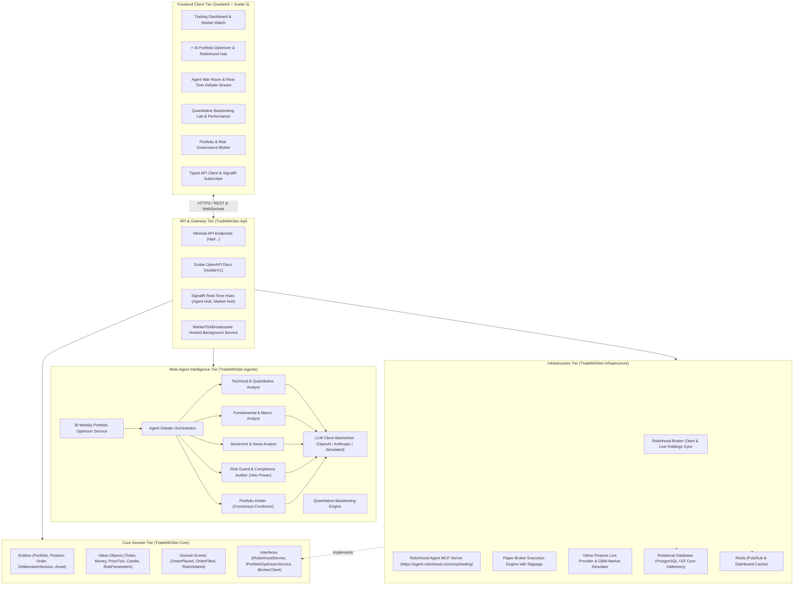

# ⚡ TradeMASter: System Architecture Specification

## 1. Executive Summary & Core Mission

**TradeMASter** is a high-performance, autonomous **Multi-Agent System (MAS)** designed to **connect directly to Robinhood accounts, inspect current investments in real time, and deploy a collaborative committee of AI agents to optimize the portfolio on an automated bi-weekly cadence**.

The platform combines an **ASP.NET Core (.NET 10)** Clean Architecture backend with an ultra-responsive **SvelteKit (Svelte 5 Runes)** web interface and **SignalR WebSockets** for live thought and price streaming.

The core philosophy of TradeMASter is **collaborative intelligence & disciplined risk governance**: rather than relying on a single monolithic model or rigid rebalancing rules, TradeMASter orchestrates a committee of 5 specialized AI agents (Technical, Fundamental, Sentiment, Risk Guard, and Portfolio Arbiter) that debate, validate hypotheses, stress-test risk exposures, compute institutional risk-parity target weights, and generate safe, executable rebalancing orders.

---

## 2. High-Level Architecture Overview

TradeMASter is structured around **Clean Architecture** and **Event-Driven Architecture (EDA)** principles, separating domain logic from external brokers, LLM frameworks, databases, and UI presentation.



---

## 3. Layered Solution Structure

The project is organized in a clean monorepo containing a multi-project .NET backend, a SvelteKit frontend, a native Electron desktop shell, and Docker container configurations:

```text
TradeMASter/
├── backend/
│   ├── TradeMASter.slnx                 # Solution definition
│   │
│   ├── TradeMASter.Core/                # Domain Layer (Zero external dependencies)
│   │   ├── Common/                      # BaseEntity, ValueObject, Result<T> monad
│   │   ├── Entities/                    # Asset, Portfolio, Position, Order, DeliberationSession
│   │   ├── Enums/                       # AssetType, OrderType, OrderSide, AgentRole, DecisionVerdict
│   │   ├── Events/                      # OrderPlacedEvent, OrderFilledEvent, RiskViolatedEvent
│   │   ├── ValueObjects/                # Ticker, Money, PriceTick, Candle, RiskParameters
│   │   ├── Backtesting/                 # BacktestRequest, BacktestTrade, BacktestPerformanceMetrics
│   │   └── Interfaces/                  # IRobinhoodService, IPortfolioOptimizerService, IBrokerClient
│   │
│   ├── TradeMASter.Agents/              # Multi-Agent Intelligence Layer
│   │   ├── Personas/                    # Specialized AI agent implementations
│   │   │   ├── TechnicalAnalyst.cs      # EMA, RSI, MACD, Bollinger Bands, ATR analysis
│   │   │   ├── FundamentalAnalyst.cs    # P/E, EV/EBITDA, margins, growth, macro interest rates
│   │   │   ├── SentimentAnalyst.cs      # Live news headlines tone, social buzz scoring
│   │   │   ├── RiskAuditor.cs           # Veto power, concentration caps, 1.5x ATR stops
│   │   │   └── PortfolioArbiter.cs      # Conflict moderation, consensus synthesis
│   │   ├── Orchestration/               # Deliberation loop, cross-examination & persistence
│   │   ├── Optimization/                # Bi-Weekly Portfolio Optimizer & Rebalancer
│   │   ├── Backtesting/                 # Quantitative historical strategy simulator
│   │   ├── Tools/                       # Quantitative indicator calculators & financial feeds
│   │   └── LLM/                         # OpenAI, Anthropic, and Simulated fallback clients
│   │
│   ├── TradeMASter.Infrastructure/      # Infrastructure & Data Layer
│   │   ├── Persistence/                 # EF Core TradeMASterDbContext & configurations
│   │   ├── Repositories/                # PortfolioRepository, AssetRepository, OrderRepository
│   │   ├── Brokers/                     # PaperBrokerService and RobinhoodBrokerService
│   │   ├── MarketData/                  # YahooFinanceProvider, SimulatedProvider, MarketDataService
│   │   └── Cache/                       # RedisCacheService & InMemoryCacheService
│   │
│   ├── TradeMASter.Api/                 # Host Layer (ASP.NET Core Minimal APIs)
│   │   ├── Endpoints/                   # Route groups (Robinhood, Optimizer, Agents, Market, Orders)
│   │   ├── Hubs/                        # SignalR Hubs (AgentDebateHub, MarketDataHub)
│   │   └── Services/                    # MarketTickBroadcaster background service
│   │
│   └── TradeMASter.Tests/               # Automated Test Suite (Domain, Indicators, Risk, Backtest)
│
├── frontend/                            # SvelteKit + Svelte 5 Runes Frontend
│   ├── src/
│   │   ├── lib/
│   │   │   ├── api/                     # Typed services (robinhood.ts, optimizer.ts, agents.ts)
│   │   │   ├── components/              # Svelte 5 Charts, Blotters, Tickers, Widgets
│   │   │   └── realtime/                # SignalR WebSocket connection manager
│   │   └── routes/                      # SvelteKit pages
│   │       ├── +page.svelte             # Dashboard & Quick Trade Widget
│   │       ├── optimizer/               # ⚡ Autonomous Bi-Weekly Optimizer & Robinhood Hub
│   │       ├── agents/                  # Real-Time Agent War Room
│   │       ├── backtesting/             # Quantitative Backtesting Lab
│   │       ├── market/                  # Screener & Candlestick Charts
│   │       └── portfolio/               # Holdings & Risk Blotter
│   └── vite.config.ts                   # Vite proxy configuration (/api, /hubs)
│
├── desktop/                             # Native Electron desktop shell
├── Dockerfile                           # Multi-stage production container build
├── docker-compose.yml                   # Complete App + Postgres + Redis stack
├── package.json                         # Root orchestration scripts
└── README.md                            # Complete user & developer documentation
```

---

## 4. Multi-Agent System & Bi-Weekly Optimizer

### 4.1 Specialized Agent Personas

| Persona | Core Objective & Methodology | Output Contribution |
| :--- | :--- | :--- |
| **📈 Technical & Quantitative Analyst** | Evaluates price structure, EMA trends (9, 21, 50, 200), RSI momentum, MACD histogram expansions, Bollinger Band bands, and ATR volatility. | Directional Signal (`StrongBuy`, `Bullish`, `Neutral`, `Bearish`), Confidence Score %, Support/Resistance levels. |
| **🏢 Fundamental & Macro Analyst** | Analyzes DCF valuation multiples (P/E, Forward P/E, EV/EBITDA), YoY Revenue Growth %, Net Margin %, Debt/Equity, and interest rate environments. | Valuation assessment, earnings quality score, multiple expansion justification. |
| **📰 Sentiment & News Analyst** | Processes breaking news headlines, SEC regulatory filings tone, and social buzz momentum. | Aggregate sentiment score (-1.0 to +1.0), dominant catalyst themes. |
| **🛡️ Risk Guard & Compliance Auditor** | Holds **absolute VETO power**. Enforces maximum single-position concentration limits (% of equity), liquid cash reserves, and portfolio drawdown ceilings. | Veto Clearance / Rejection, Volatility-adjusted 1.5x ATR Stop-Loss & Take-Profit targets, Max allowable trade sizing. |
| **⚖️ Portfolio Arbiter (Lead Conductor)** | Moderates cross-examinations when agent hypotheses clash, resolves conflicts, and outputs weighted consensus directives (`BUY`, `SELL`, `HOLD`, `VETOED`). | Executive consensus directive, optimal target weightings, proposed order requests. |

---

### 4.2 Autonomous Bi-Weekly Rebalancing Lifecycle

```mermaid
sequenceDiagram
    autonumber
    actor UserOrSchedule as 14-Day Cadence Trigger / User On-Demand
    participant Opt as Portfolio Optimizer Service
    participant RH as Robinhood Broker Service
    participant Orch as Agent Debate Orchestrator
    participant Agents as 5-Agent Committee
    participant Risk as Risk Guard (Veto Power)
    participant Exec as Execution Engine / Broker
    participant UI as Svelte 5 Web / Desktop UI

    UserOrSchedule->>Opt: Initiate Bi-Weekly Portfolio Optimization
    Opt->>RH: Sync Live Holdings (NVDA, AAPL, MSFT, TSLA, BTC, SPY) & Cash
    RH-->>Opt: Live Portfolio State Ingested

    loop For Each Holding in Portfolio
        Opt->>Orch: Evaluate Asset Setup & Narrative Health
        par Parallel Committee Deliberation
            Orch->>Agents: Technical, Fundamental & Sentiment Analysis
        end
        Agents-->>Orch: Signals & Factor Scores
        Orch->>Orch: Portfolio Arbiter Cross-Exam & Target Weighting
        Orch-->>Opt: Asset Recommendation (Target Weight %)
    end

    Opt->>Opt: Calculate Weight Deltas (Current % vs Target %)
    Opt->>Opt: Generate Sizing Orders (+ Scale In / - Trim)
    
    Opt->>Risk: Submit Batch Rebalance Plan for Turnover & Exposure Audit
    alt Risk Parameter Breached
        Risk-->>Opt: Veto / Adjust Target Caps
    else Risk Approved
        Risk-->>Opt: Plan Cleared
    end

    Opt->>UI: Present Optimization Plan & Allocation Comparison
    
    opt 1-Click Execution
        UserOrSchedule->>Opt: Approve & Execute Rebalance
        Opt->>Exec: Route Sells First (Unlock Cash), then Buys
        Exec->>RH: Execute Orders in Sequence
        RH-->>Opt: Execution Receipts Confirmed
        Opt->>Opt: Advance Next Scheduled Rebalance by 14 Days
        Opt->>UI: Render Rebalance Completion Receipt
    end
```

---

## 5. Domain Models & REST API Endpoints

### 5.1 REST Endpoint Catalog

| Endpoint Group | Method & Route | Description |
| :--- | :--- | :--- |
| **Robinhood Integration** | `POST /api/robinhood/connect` | Connect Robinhood account credentials / token or enable demo sandbox. |
| | `GET /api/robinhood/status` | Get connection state, total equity, cash available, and buying power. |
| | `GET /api/robinhood/holdings` | Get live portfolio holdings, cost basis, quantities, and weights. |
| | `POST /api/robinhood/sync` | Force synchronization of Robinhood holdings into TradeMASter database. |
| **Bi-Weekly Optimizer** | `POST /api/optimizer/run` | Run multi-agent committee optimization across all portfolio holdings. |
| | `POST /api/optimizer/execute` | Approve and batch-execute proposed rebalancing trades. |
| | `GET /api/optimizer/schedule` | Get next automated bi-weekly rebalance timestamp & cadence info. |
| **Multi-Agent Committee**| `POST /api/agents/deliberate` | Trigger single-asset live committee debate and consensus synthesis. |
| | `GET /api/agents/history` | Retrieve archived committee sessions and debate transcripts. |
| | `GET /api/agents/session/{id}` | Retrieve full decision breakdown for a specific deliberation session. |
| **Backtesting Engine** | `POST /api/backtest/run` | Run historical strategy simulation with slippage, fees, and Sharpe ratio. |
| | `GET /api/backtest/strategies` | List registered quantitative strategies and descriptions. |
| **Market Data** | `GET /api/market/quote/{symbol}`| Fetch latest price tick, volume, and 24h change. |
| | `GET /api/market/candles/{symbol}`| Fetch OHLCV candlestick time series with custom timeframe intervals. |
| | `GET /api/market/watchlist` | Get streaming price ticks for top monitored assets. |
| **Portfolio & Orders** | `GET /api/portfolio` | Get active portfolio balance, total equity, and P&L metrics. |
| | `POST /api/orders` | Submit paper / broker market or limit orders. |
| | `DELETE /api/orders/{id}` | Cancel pending order. |

---

## 6. Real-Time SignalR Streaming

TradeMASter uses **SignalR WebSockets** for low-latency live streaming:

1. **`AgentDebateHub` (`/hubs/debate`)**:
   - `ReceiveDeliberationStatus(step, message)`: Live progress notifications.
   - `ReceiveAgentThought(role, name, thought, signal, confidence, factors)`: Streams individual agent reasoning and indicator pills in real time.
   - `ReceiveCrossExamMessage(speakerRole, speakerName, content, timestamp)`: Animated debate dialogue transcript.
   - `ReceiveConsensusVerdict(verdictPayload)`: Final executive synthesis directive.
2. **`MarketDataHub` (`/hubs/market`)**:
   - `ReceiveMarketTick(symbol, price, change24h, changePercent24h, volume, timestamp)`: Real-time price broadcasts across watchlist tickers.
   - `ReceiveOrderUpdate(order)`: Instant order fill notification.

---

## 7. Security, Safety & Risk Governance

1. **Multi-Tier Circuit Breakers**:
   - **Max Position Size Cap**: No single asset can exceed a configurable percentage of portfolio equity (default: 20–25%).
   - **Cash Reserve Buffer**: Rebalancing buy orders are strictly bounded by available liquid cash.
   - **ATR-Driven Stops**: Volatility-adjusted stop-loss levels automatically attached to every trade recommendation.
2. **Human-in-the-Loop Mode**:
   - Every bi-weekly rebalancing plan requires explicit user approval before execution, allowing full inspection of the proposed order ledger and persona rationales.
3. **API Key & Secret Isolation**:
   - Robinhood tokens and LLM API keys (`OPENAI_API_KEY`, `ANTHROPIC_API_KEY`) are kept exclusively on the backend server in environment variables.

---

## 8. Implementation Status Summary

| Phase | Description | Status |
| :--- | :--- | :--- |
| **Phase 1: Core Foundation & Data Feeds** | Domain models, EF Core database, Yahoo & Simulated market data feeds, Paper Broker, SvelteKit layout & dashboard. | ✅ **Complete & Verified** |
| **Phase 2: Multi-Agent Intelligence Engine** | 5 agent personas (Technical, Fundamental, Sentiment, Risk Guard, Arbiter), deliberation orchestrator, indicator tools, War Room UI. | ✅ **Complete & Verified** |
| **Phase 3: Real-Time SignalR WebSockets** | SignalR hubs (`/hubs/debate`, `/hubs/market`), tick background service, real-time thought streaming canvas. | ✅ **Complete & Verified** |
| **Phase 4: Backtesting Engine & Analytics** | Historical replay simulator, 4 quantitative strategies, Sharpe/Sortino ratios, max drawdown curve, interactive lab. | ✅ **Complete & Verified** |
| **Phase 5: Desktop Packaging & Hardening** | Electron desktop shell, xUnit automated test suite (13/13 passing), multi-stage Dockerfile, docker-compose. | ✅ **Complete & Verified** |
| **Core Goal: Robinhood & Bi-Weekly Optimizer** | Robinhood broker client, live holdings sync, bi-weekly multi-agent portfolio optimizer, 1-click batch execution, `/optimizer` UI. | ✅ **Complete & Verified** |
